 
# Criar Pull Request (PR)
 
As pull requests permitem que você informe outras pessoas sobre as alterações das quais você fez push para um branch em um repositório no GitHub Enterprise Server. Depois que uma pull request é aberta, você pode discutir e revisar as possíveis alterações com colaboradores e adicionar commits de acompanhamento antes que as alterações sofram merge no branch base.
 
---
 
###### CONTEXTUALIZAÇÃO E PASSO A PASSO PARA CRIAR O PR:
 
Você pegou uma tarefa no [Open Project](https://projetos.nasajon.com.br/) com o número **67080** onde seu título é **[Painel do Cliente] ajustes na tela de Usuários** e após realizar os ajustes necessários você deve seguir os seguintes passos:
 
---
 
*OBS: Essas etapas a seguir são realizadas em sua maioria no painel a esquerda do vscode. Somente no momento do cherry-pick e do push que são realizados no terminal.*
 
---
 
**BRANCH MASTER**
 
Você iniciou sua tarefa do sistema Painel do Cliente na branch master, e após realizar tudo que estava descrito na tarefa 67080 é só seguir os passos abaixo:
 
1. Clique no ícone **Controle do Código-Fonte** do lado esquerdo do vscode.
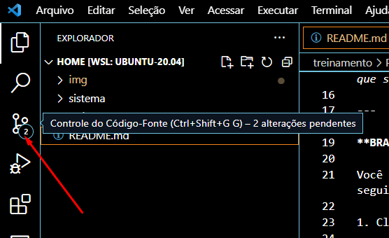
 
2. Você irá visualizar todos os arquivos alterados, criados ou excluídos neste local, e esses arquivos estarão abaixo das **Alterações**, clique no ícone **Stash all changes** que é um ícone com "sinal de mais numa seta encurvada" e só é visto ao passar o mouse sobre o título Alterações.
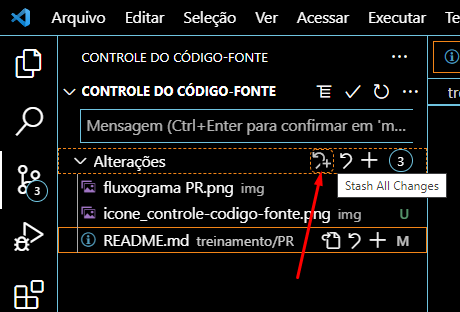
 
    2.1. Uma janela será aberta para que nomeie o stash, recomenda-se colocar o nome com o número da tarefa, portanto seria: **67080**.
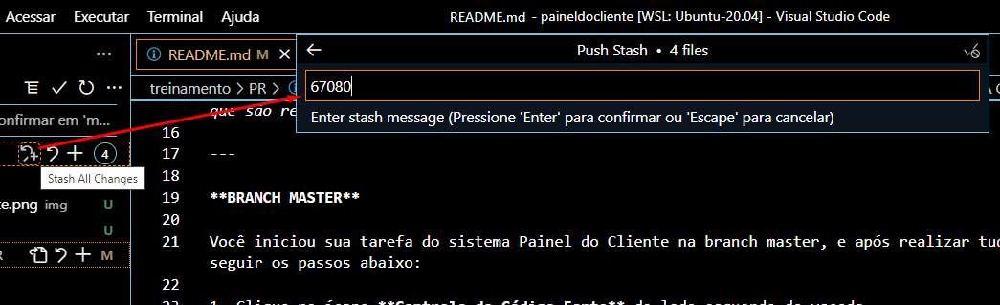
 
    2.2. Em seguida dê enter para finalizar a nomeação, neste momento todos seus arquivos desaparecem, pois estão guardados no stash: **67080**.
 
3. Agora, ainda na branch master, realize um Pull rebase, indo nos "3 pontinhos" de mais ações ao lado do título "CONTROLE DO CÓDIGO-FONTE" e em seguida ir na opção **Efetuar Pull, Enviar por Push** e clicar em **Efetuar Pull(Trocar Base)**. Ele irá pegar tudo que foi alterado na branch master enquanto estava realizando a sua tarefa.
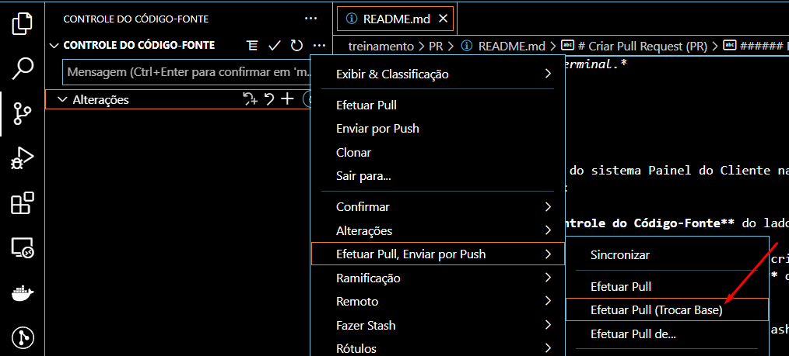
 
4. Em seguida crie uma branch, essa branch será a branch criada a partir da branch master, recomenda-se criar a branch com o número da tarefa, dessa forma vá nos "3 pontinhos" de mais ações ao lado do título "CONTROLE DO CÓDIGO-FONTE" e em seguida ir na opção **Ramificação** e clicar em **Criar Ramificação**, uma janela será aberta para nomear a branch/ramificação, digite "67080-m" e dê enter.
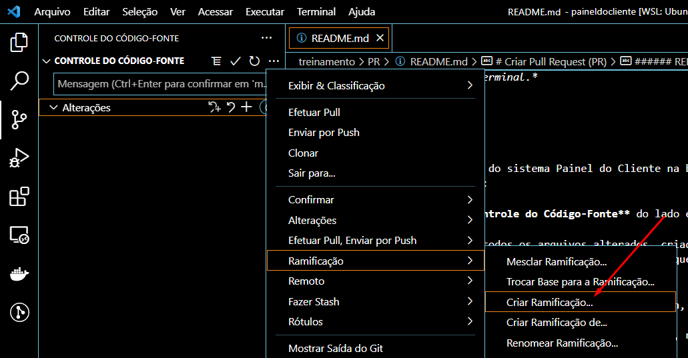
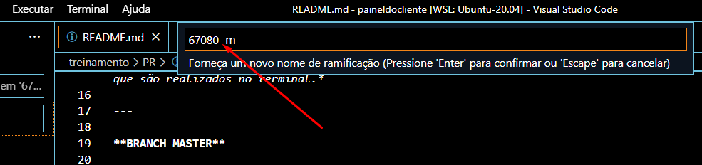
 
5. Neste momento você está na branch "67080-m", dessa forma vá nos "3 pontinhos" de mais ações ao lado do título "CONTROLE DO CÓDIGO-FONTE" e em seguida ir na opção **Fazer Stash** e clicar em **Aplicar Stash**, uma janela será aberta para selecionar a stash que tinha criado na *etapa 2.2.* com o nome de *67080*. E será visualizado todos os arquivos que tinha alterado durante a realização da sua tarefa.
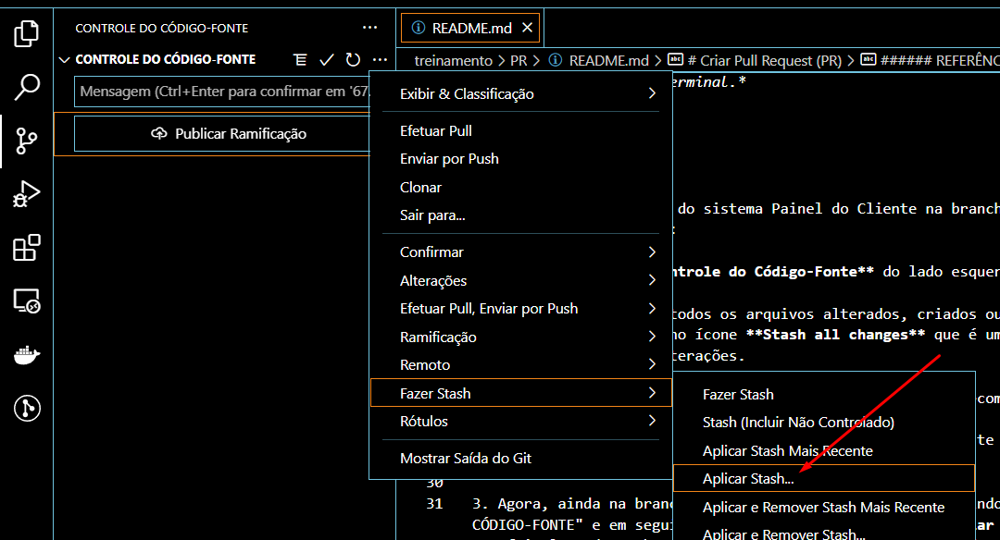
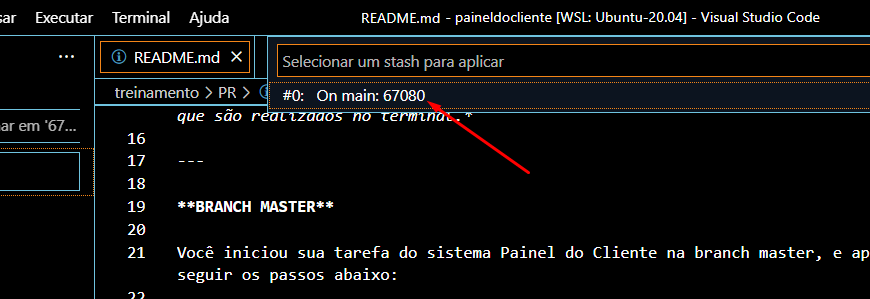
 
6. No título **Alterações**, clique no ícone **Preparar Todas as Alterações** que é um ícone com "sinal de mais" e só é visto ao passar o mouse sobre o título Alterações. Eles serão remanejados para o título **Alterações Preparadas**.
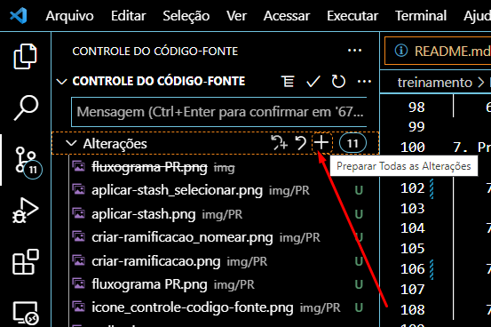
 
7. Agora será realizado o commit, que é a mensagem sobre o que foi realizado nessa tarefa. Para isso clique no campo onde está escrito "Mensagem(Ctrl+Enter para confirmar em..." e digite a seguinte mensagem:
 
    7.1. Painel do Cliente - Dívida Técnica - 67080 - ajustes na tela de Usuários, e depois clique no ícone que se parece com "um check" que se chama **Confirmar** ao lado do título "CONTROLE DO CÓDIGO-FONTE" e esse ícone só aparece ao passar o mouse ao lado desse título.

    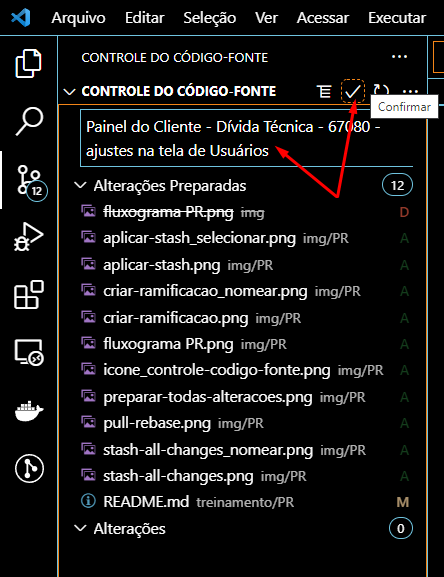
 
    7.2. A mensagem acima na *etapa 7.1.* segue a seguinte sintaxe:
 
        7.2.1. Nome do Sistema - Tipo da tarefa - número da tarefa - título da tarefa
 
8. E por fim, realize o push, indo nos "3 pontinhos" de mais ações ao lado do título "CONTROLE DO CÓDIGO-FONTE" e em seguida ir na opção **Efetuar Pull, Enviar por Push** e clicar em **Enviar por Push**. Esta etapa fará com que toda sua tarefa realizada em seu computador seja enviada ao repositório do sistema, neste caso do sistema Painel do Cliente. Dessa forma faça a seguinte etapa:
 
    8.1. Ao clicar em **Enviar por Push** pela rota do *passo 8.*:

    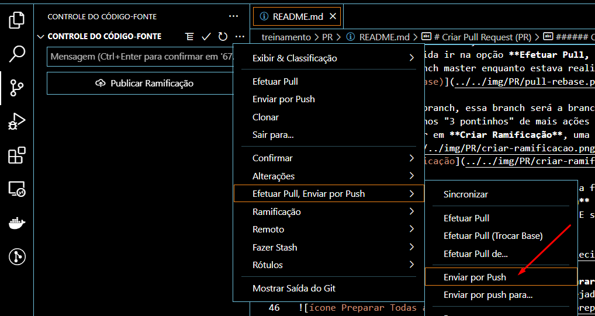
 
    8.2. Vai aparecer uma janela dizendo que sua ramificação não foi publicada, clique em OK e vá para o repositório do projeto que enviou o push.

    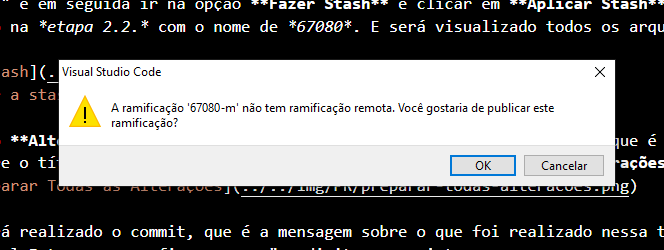

    8.3. No repositório do projeto verá que tem uma mensagem que precisa realizar o PR.

    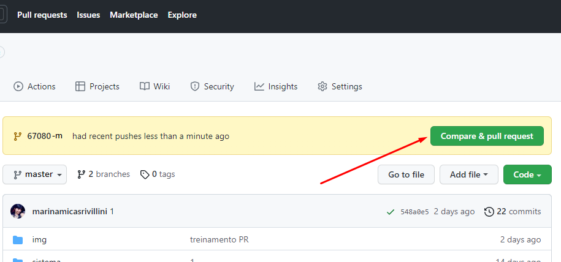

    8.4. Ao clicar no botão **Compare & pull request** para realizar o PR, é só preencher o template do PR e marcar o Reviewers. Onde está detalhado esses passos na *etapa 9.*.

    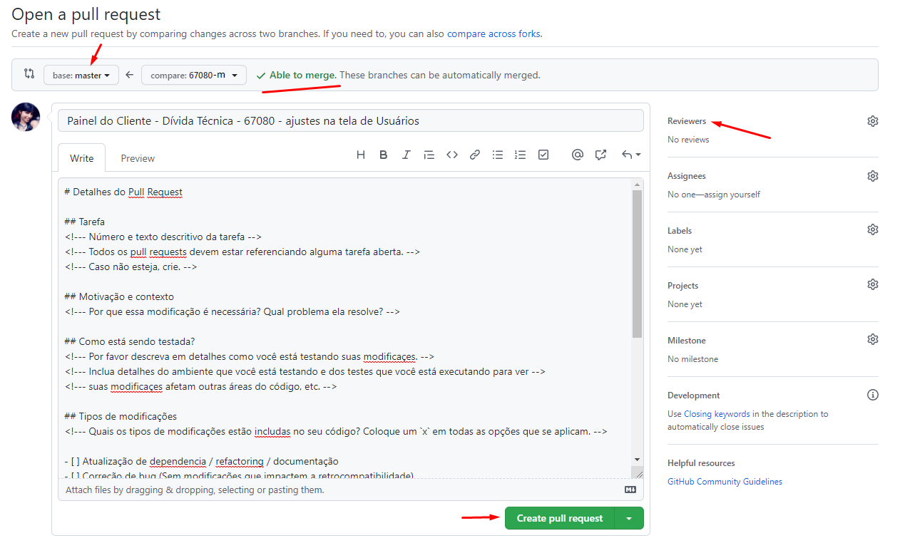
 
9. Preencher o PR no github, siga os seguintes passos:
 
    9.1. Confira se a branch 67080-m está apontando para a branch master.
   
    9.2. Preencha o template de markdown visualizado na aba Write.
   
    9.3. Depois marque o revisor dessa tarefa, que normalmente é o Tech Lead.
   
    9.4. E por fim clique no botão **Create Pull Request**.
 
ATENÇÃO! Não feche essa janela do navegador caso precise replicar esta tarefa que foi realizada a partir da branch master para outra branch/ramificação, que normalmente replica-se para a branch development.
 
---
 
**BRANCH DEVELOPMENT**
 
Você terminou de criar sua tarefa na branch master, e agora precisa pegar tudo que foi realizada lá e enviar para a branch development. Para isso bastar seguir as etapas abaixo:
 
1. Mude de branch indo nos "3 pontinhos" de mais ações ao lado do título "CONTROLE DO CÓDIGO-FONTE" e em seguida ir na opção **Ramificação** e clicar em **Trocar Base para a Ramificação**:
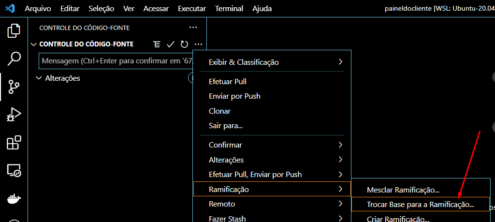

    1.1. Uma janela será aberta para você selecionar a branch que deseja ir, selecione a branch/ramificação development.

    1.2. Caso não note mudanças da branch/ramificação na barra de Status do vscode (que é a barra localizada no inferior do vscode), você pode clicar diretamente nele e selecionar a branch desejada.
    
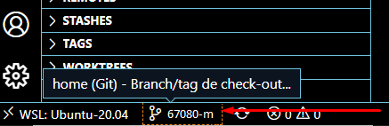
 
2. Ainda na branch development, realize um Pull rebase, indo nos "3 pontinhos" de mais ações ao lado do título "CONTROLE DO CÓDIGO-FONTE" e em seguida ir na opção **Efetuar Pull, Enviar por Push** e clicar em **Efetuar Pull(Trocar Base)**. Ele irá pegar tudo que foi alterado na branch development enquanto estava realizando a sua tarefa.
 
3. Agora crie uma branch, essa branch será a branch criada a partir da branch development, recomenda-se criar a branch com o número da tarefa, dessa forma vá nos "3 pontinhos" de mais ações ao lado do título "CONTROLE DO CÓDIGO-FONTE" e em seguida ir na opção **Ramificação** e clicar em **Criar Ramificação**, uma janela será aberta para nomear a branch, digite "67080-d" e dê enter.
 
4. Na janela que deixou aberto do PR da branch master, vá na aba Commits e no lado direito do seu commit clique no ícone que tem "dois quadrados sobrepostos" com o nome de **Copy the full SHA**, isso irá copiar o hash do commit na área de transferência e retornando ao vscode digite o seguinte comando:
 
    4.1. git cherry-pick -n *[AQUI SERÁ COLADO O HASH DO COMMIT]*
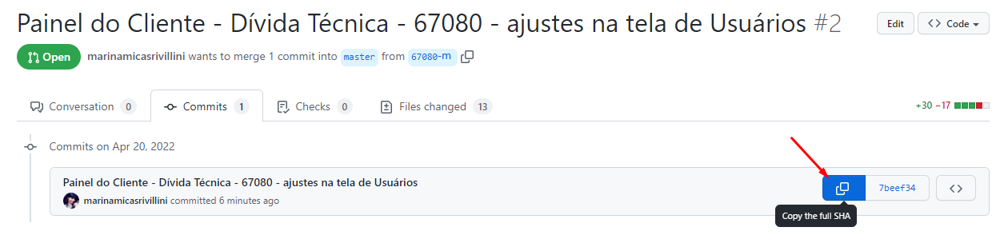
 
5. Agora será realizado o commit, e como foi realizado um cherry-pick, os arquivos que foram modificados no momento que a tarefa foi realizada na branch master, eles irão aparecer juntamente com a mesma mensagem que foi criada na branch anterior:
 
    5.1. Painel do Cliente - Dívida Técnica - 67080 - ajustes na tela de Usuários, e depois clique no ícone que se parece com "um check" que se chama **Confirmar** ao lado do título "CONTROLE DO CÓDIGO-FONTE" e esse ícone só aparece ao passar o mouse ao lado desse título.
 
6. Chegou o momento do push, indo nos "3 pontinhos" de mais ações ao lado do título "CONTROLE DO CÓDIGO-FONTE" pode ser muito demorado como percebido na etapa da branch master, mas isso pode ser encurtado indo pelo terminal do vscode para que uma URL seja criada e você possa dali mesmo acessar o github diretamente com o seu PR para ser finalizado. Dessa forma faça a seguinte etapa:
 
    6.1. Vá para o terminal do vscode e digite: git push origin 67080-d
 
    6.2. Acesse a url criada pressionando o CTRL acima dela e clicando em seguida.
 
7. Preencher o PR no github, siga os seguintes passos:
 
    7.1. Confira se a branch 67080-d está apontando para a branch development.
   
    7.2. Preencha o template de markdown visualizado na aba Write.
   
    7.3. Depois marque o revisor dessa tarefa, que normalmente é o Tech Lead.
   
    7.4. E por fim clique no botão **Create Pull Request**.
 
---
 
Para realizar as etapas acima utilizando somente o terminal, pode fazer conforme o seguinte fluxograma:
 

 
Acesse também o link da [imagem do fluxograma publicado](https://viewer.diagrams.net/?tags=%7B%7D&highlight=0000ff&edit=_blank&layers=1&nav=1#G1gCvnOQ6-5K4I7lCedE5268bpthF3v_GD).
 
---
 
###### REFERÊNCIAS:
[Sobre pull requests](https://docs.github.com/pt/enterprise-server@3.0/pull-requests/collaborating-with-pull-requests/proposing-changes-to-your-work-with-pull-requests/about-pull-requests)

[Sobre git stash](https://git-scm.com/docs/git-stash/pt_BR)

[Sobre git rm](https://git-scm.com/docs/git-rm)